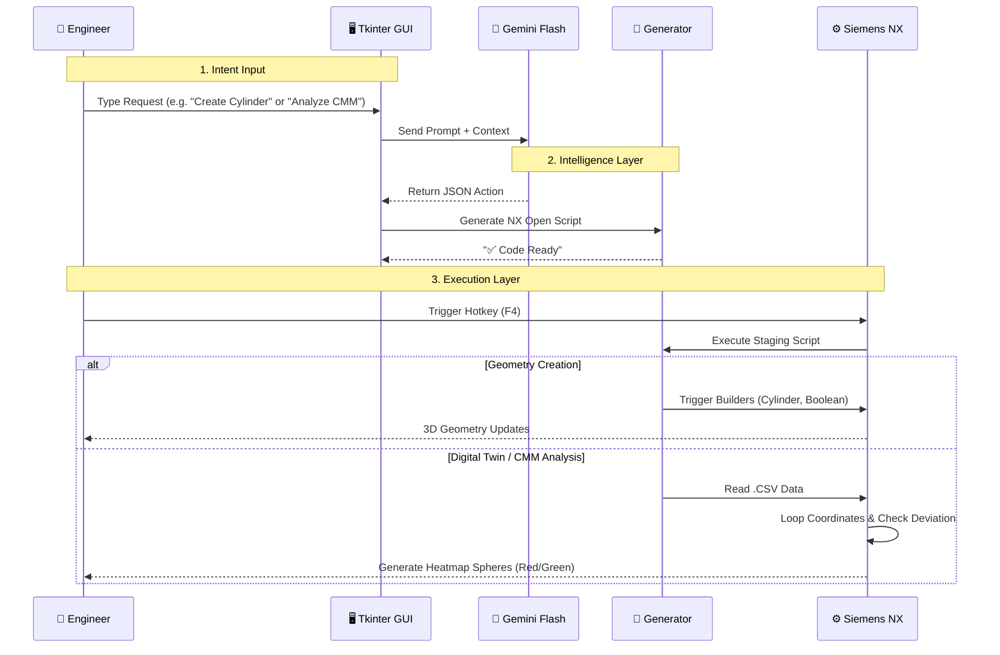

# Siemens NX AI Copilot & Digital Twin Assistant

**An AI-powered engineering assistant for Siemens NX that controls CAD modeling and Digital Twin analysis using Natural Language commands. Powered by Google Gemini Flash, Python.**


*(Placeholder for your high-quality GIF/Video)*

##  Problem Statement
In traditional CAD workflows (Aerospace/Automotive/Wind), engineers face two major bottlenecks:
1.  **Repetitive Modeling Tasks:** Creating standard geometry, modifying features, and setting up views requires hundreds of manual clicks.
2.  **High Barrier to Automation:** Automating these tasks typically requires deep knowledge of the complex **NX Open API** (C++, Python, .NET), which is difficult for many mechanical engineers to master.

**The Result:** Engineers spend more time navigating menus than designing, and valuable quality data (CMM reports) often sits in Excel sheets rather than being visualized on the 3D model.

## 💡 The Solution
I developed an **AI Copilot** that bridges the gap between Large Language Models (LLMs) and Mechanical Design.
By integrating **Google Gemini Flash** with the **NX Open API**, this tool allows engineers to execute complex CAD operations using plain English prompts.

**Key Benefits:**
* **Zero-Code Automation:** Users can trigger scripts like "Cut a notch at X 35" without writing a single line of code.
* **Digital Twin Visualization:** Instantly ingests real-world CMM data (CSV) and maps deviation heatmaps onto the 3D blade surface.
* **Context Awareness:** The AI understands "creation" vs. "modification" (e.g., changing the color of an existing part vs. making a new one).

##  Architecture & Logic
The application follows a **Retrieval-Action** pipeline:

1.  **User Input:** The engineer types a command into the Custom Tkinter GUI (e.g., *"Create a cylinder of h=400mm and d=200mm"*).
2.  **Intent Extraction (LLM):** The input is sent to **Google Gemini Flash**, which maps the request to a strict JSON Schema (extracting parameters like Diameter, Height, Coordinates).
3.  **Execution (NX Open):** The Python backend parses the JSON and triggers the corresponding NX Open Builders (CylinderBuilder, BooleanBuilder, SphereBuilder) inside the active session.

## ⚙️ Technical Implementation Details
The application is built on a hybrid architecture combining a threaded Python GUI with the proprietary Siemens NX environment.

### 1. Generative AI Integration
* **Model:** Google Gemini Flash (optimized for low latency).
* **Structured Output:** The system uses "Few-Shot Prompting" to force the LLM to output executable JSON data, eliminating hallucinated code.
* **Threading:** The API calls run on background threads to prevent the GUI from freezing while the AI "thinks."


### 2. Digital Twin / CMM Analysis
The tool features a dedicated engine for Quality Assurance:
* **Data Parsing:** Reads raw CMM CSV data (X, Y, Z, Deviation).
* **Visual Feedback:** Programmatically instantiates hundreds of **Sphere objects** on the blade surface.
* **Logic:** Applies conditional coloring (Red = Deviation > 0.5mm, Green = Nominal) to create an instant 3D heatmap for the engineer.

### 🔄 System Architecture




## 💻 Code Snippet
The core logic that maps the AI's JSON response to actual NX Open Geometry creation:

```python
def generate_code(self, data):
    script = TEMPLATE_HEADER + "\n"
    act = data.get("action")
    
    # Dynamic Code Generation based on AI Intent
    if act == "create":
        script += f"        create_cylinder({data.get('d', 100)}, {data.get('h', 200)}, '{data.get('color', 'red')}')\n"
        
    elif act == "notch":
        # Passes extracted coordinates (X, Y, Z) to the Boolean Engine
        script += f"        create_custom_notch({data.get('x', 35)}, {data.get('y', 0)}, {data.get('z', 0)}, {data.get('d', 50)})\n"
        
    elif act == "cmm":
        # Triggers the Digital Twin Engine with the file path
        path = data.get('path', r'C:\Temp\Dummy_Blade_CMM_Report.csv')
        script += f"        analyze_cmm_data(r'{path}')\n"

    script += "    except Exception as e:\n        pass\n\nif __name__ == '__main__':\n    main()"
    return script
```

## 🔐 Source Code & Collaboration
This project is currently closed-source for portfolio demonstration as it is being refined for more prompts and features.

The full source code (GUI implementation, Gemini Prompt Engineering, and NX Open scripts) is available for Code Review or Collaboration upon request.

## 🤝 How to Request Access
I am actively looking for collaborators and feedback! If you are a hiring manager or developer interested in the technical details:

Email: Aneesh.binage06@gmail.com

LinkedIn: [Aneesh Shridhar B](https://www.linkedin.com/in/aneesh-shridhar-b-165468154/)
